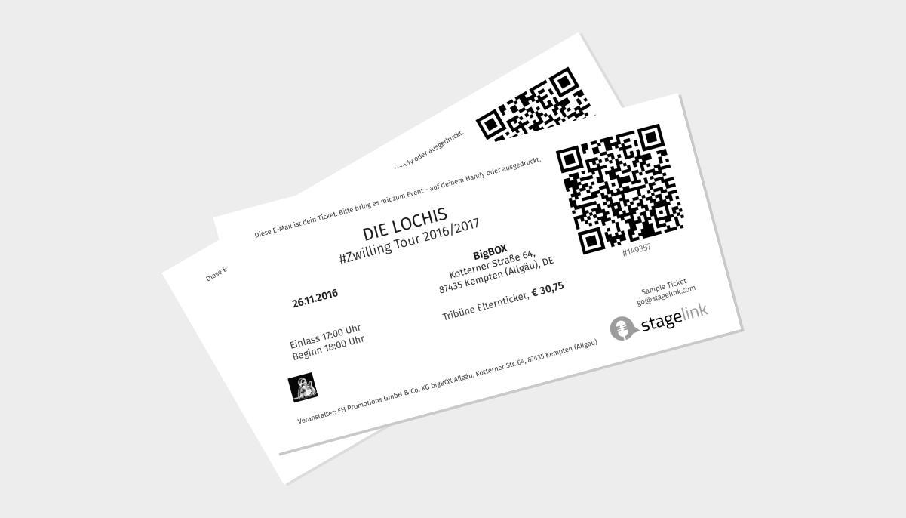
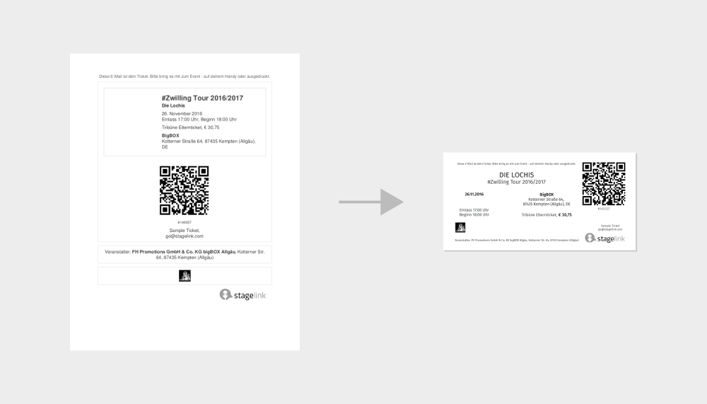

Stworzenie nowego projektu biletu było moim zadaniem rekrutacyjnym do berlińskiego startupu <a href="https://stagelink.com">Stagelink</a>. Punktem wyjścia był aktualny bilet w&nbsp;formacie, którego mockup zamieszczono poniżej. Głównym celem zadania było zaprojektowanie nowej architektury informacji na bilecie.

Wymagania dla nowego projektu:

<ul class="req">
	<li>format biletu - maksymalnie 1/3 obszaru kartki A4,</li>
	<li>przyjazny w&nbsp;druku,</li>
	<li>zawierający wszystkie informacje z&nbsp;aktualnego biletu,</li>
	<li>czas na wykonanie zadania - 60 min.</li>
</ul>

O projekcie: Stagelink to aplikacja skierowana zarówno do fanów muzyki, jak i&nbsp;artystów-youtuberów oraz managerów.
Umożliwia ona głosowanie na miejscowość, do której fani chcieliby zaprosić danego artystę. Użytkownik podaje również kwotę jaką byłby w&nbsp;stanie zapłacić za bilet. Artysta ma możliwość śledzenia liczby zaproszeń do danego miasta, co ułatwia mu organizację trasy koncertowej z&nbsp;uwzględnieniem informacji o&nbsp;miejscu i&nbsp;cenach biletów. Aplikacja oferuje jednocześnie sprzedaż biletów online.

	

	

