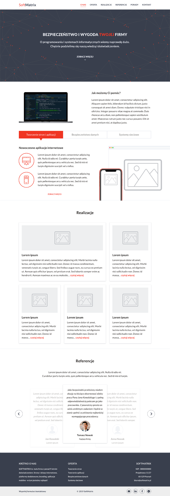
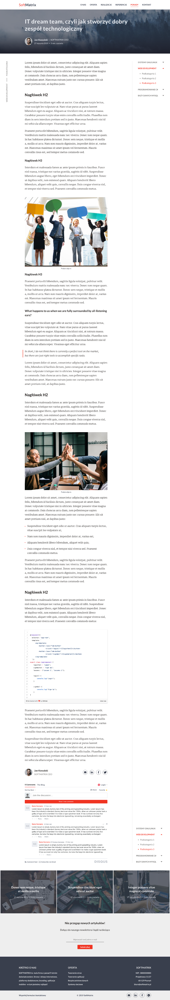
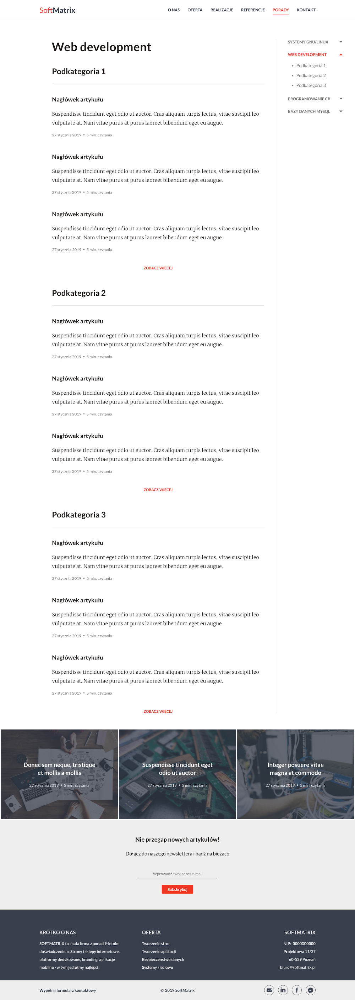

Dla firmy <a target="_blank" href="https://www.facebook.com/softmatrix/">SoftMatrix</a> przygotowałam mockup nowej
	strony internetowej. Projekt strony obejmuje landing page oraz makiety dla firmowego bloga. Poniższe screeny
	przedstawiają kolejno widok strony głównej, arytkuł wraz z&nbsp;wszystkimi elementami, takimi jak nagłówki,
	paragrafy, cytaty, bloki kodu czy też komentarze oraz widok grupy artykułów.

<h2>O firmie SoftMatrix</h2>

SoftMatrix jest małą firmą o&nbsp;profilu informatycznym zajmującą się dostarczaniem kompleksowych rozwiązań
	związanych z&nbsp;branżą IT. Specjalizuje się w&nbsp;projektowaniu i&nbsp;dostarczaniu rozwiązań informatycznych,
	jak również w&nbsp;kompleksowym doradztwie w&nbsp;zakresie informatyzacji.

	

	

	

