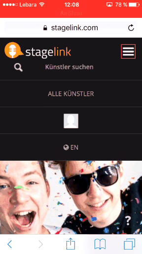

W 2016&nbsp;r. pracowałam na stanowisku UX researcher dla startupu <a href="https://stagelink.com">Stagelink</a> w&nbsp;Berlinie. Moją 3-miesięczną pracę rozpoczęłam od określenia podstawowego segmentu klientów oraz wskazania problemów, które zamierzałam rozwiązać.

Moim celem było uzyskanie informacji dotyczących otoczenia rynkowego, organizacji, konkurencji oraz innych czynników, które mogły mieć wpływ na przyszłe sukcesy startupu. Badałam potrzeby rynkowe użytkowników portalu Stagelink oraz identyfikowałam mocne i&nbsp;słabe strony aplikacji i&nbsp;różnice w&nbsp;stosunku do konkurencyjnych serwisów. Przekształcenie dużej ilości informacji w&nbsp;mniejsze, bardziej praktyczne porcje pozwoliło na uzyskanie merytorycznej wiedzy, co stanowiło podstawę do dalszych działań.

	

Serwis internetowy już istniał, więc chcieliśmy jak najszybciej poprawić problemy, które miały największy wpływ na kluczowe dla nas wskaźniki. Potrzebowałam bezpośredniej informacji zwrotnej na temat pozytywnych i&nbsp;negatywnych doświadczeń użytkowników, w&nbsp;związku z&nbsp;czym opracowałam scenariusze testowe i&nbsp;przeprowadziłam testy użyteczności z&nbsp;9&nbsp;użytkownikami. Zaproszeni respondenci zostali wybrani na podstawie przygotowanej <a target="_blank" href="https://funktionstests.typeform.com/to/DoiC5z">ankiety</a>. Badania odbyły się z&nbsp;wykorzystaniem prawdziwej, produkcyjnej wersji aplikacji Stagelink. Podczas każdego testu użytkownik otrzymywał telefon z&nbsp;uruchomioną stroną internetową, na której wykonywał określone zadania. Testy były rejestrowane -&nbsp;zapisywany był dźwięk oraz ekran telefonu (fragment testu został zamieszczony powyżej w&nbsp;formie animacji).

Na podstawie danych uzyskanych podczas przeprowadzonych badań przygotowałam 40-stronnicowy raport zawierający m.in.:

<ul class="requirements">
	<li>
charakterystykę badanych użytkowników,
</li>
	<li>
opisy przeprowadzonych testów,
</li>
	<li>
wskaźniki opisujące główne miary użyteczności aplikacji,
</li>
	<li>
mocne strony aplikacji,
</li>
	<li>
analizy zaobserwowanych problemów,
</li>
	<li>
rekomendacje użytecznościowe i&nbsp;designowe mające na celu poprawę produktu.
</li>
</ul>
Podczas swojej pracy współpracowałam z&nbsp;UX designerem, programistami oraz marketingowcami.

<h2>O startupie Stagelink</h2>

Stagelink to aplikacja skierowana zarówno do fanów muzyki, jak i&nbsp;artystów / youtuberów oraz managerów. Umożliwia ona głosowanie na miejscowość, do której fani chcieliby zaprosić danego artystę. Użytkownik podaje również kwotę jaką byłby w&nbsp;stanie zapłacić za bilet. Artysta ma możliwość śledzenia liczby zaproszeń do danego miasta, co ułatwia mu organizację trasy koncertowej z&nbsp;uwzględnieniem informacji o&nbsp;miejscu i&nbsp;cenach biletów. Aplikacja oferuje jednocześnie sprzedaż biletów online.

