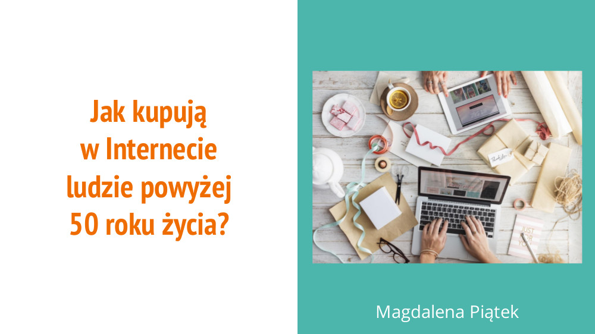

Badanie miało na celu poznanie zachowań związanych z&nbsp;kupowaniem online przez osoby w&nbsp;wieku 50 i&nbsp;więcej lat, a&nbsp;w&nbsp;szczególności przyjrzenie się postawom wobec zakupów internetowych wśród przebadanych osób. Dążyłam do tego, aby dowiedzieć się jakie produkty wybiera dana grupa wiekowa oraz skąd czerpie informacje na ich temat. Istotne było również określenie motywacji w&nbsp;zakresie wyboru sklepów internetowych. Uwzględniłam także kwestię preferencji dotyczących sposobu realizacji transakcji online oraz stopień korzystania z&nbsp;urządzeń mobilnych. Omawiany projekt był moim zadaniem rekrutacyjnym na staż do firmy <a target="_blank" href="https://allegro.pl/praca/staze">Allegro</a>.

Realizację zadania rozpoczęłam od przygotowania planu badań, który stanowił podstawę do dalszych działań. Następnie skupiłam się na dokładnym poznaniu użytkownika, m.in. kim jest, jakimi potrzebami się kieruje, jakie są jakiego zachowania internetowe oraz co go wyróżnia na tle innych. Kolejnym krokiem było określenie jakie metody badawcze można wykorzystać do tego badania. Ze względu na ograniczony czas wykonania zadania musiałam zdecydować, które z&nbsp;zaproponowanych w&nbsp;planie metod badawczych będą najodpowiedniejsze i&nbsp;możliwe do wykonania w&nbsp;krótkim czasie. W dalszej kolejności przeprowadziłam badania z&nbsp;użytkownikami w&nbsp;wieku 50+. Zdobyte informacje pozwoliły zrozumieć mi potrzeby omawianej grupy wiekowej i&nbsp;odpowiedzieć na zadane wcześniej pytania. W&nbsp;końcowej części zadania skupiłam się na przedstawieniu wniosków oraz zaleceń.

Badanie zostało zrealizowane z&nbsp;wykorzystaniem metod: Persony, Customer Journey Map, Testów użyteczności, Focus Group oraz Card sorting. Dane zbierane były od 1&nbsp;do 8&nbsp;maja 2017&nbsp;r. Badaniu poddanych było 6&nbsp;portali (Allegro.pl, Ceneo.pl, Morele.net, Euro.com.pl, Zalando.pl, Answear.pl), których kryterium była liczba odwiedzin (wg badania <a target="_blank" href="https://www.gemius.pl/wszystkie-artykuly-aktualnosci/wyniki-badania-megapanel-pbigemius-za-sierpien-2015.html">Megapanel/PBI</a> za sierpień 2015&nbsp;r.) oraz rankingu sklepów internetowych <a target="_blank" href="https://static.opineo.pl/press/dl/ranking-sklepow-internetowych-opineo-2015.pdf">Opineo.pl</a> 2015&nbsp;r.

W efekcie powstała <a target="_blank" href="../assets/projects/allegro/ux-allegro-presentation.pdf">prezentacja</a> przedstawiająca zachowania zakupowe grupy 50+. Poniżej zaprezentowano również kilka wybranych slajdów.

	

<ul class="gallery">
	<li class="item" href="../assets/projects/allegro/1.jpg" style="background-image: url(../assets/projects/allegro/1.jpg);"></li>
	<li class="item" href="../assets/projects/allegro/2.jpg" style="background-image: url(../assets/projects/allegro/2.jpg);"></li>
	<li class="item" href="../assets/projects/allegro/3.jpg" style="background-image: url(../assets/projects/allegro/3.jpg);"></li>
	<li class="item" href="../assets/projects/allegro/4.jpg" style="background-image: url(../assets/projects/allegro/4.jpg);"></li>
	<li class="item" href="../assets/projects/allegro/5.jpg" style="background-image: url(../assets/projects/allegro/5.jpg);"></li>
	<li class="item" href="../assets/projects/allegro/6.jpg" style="background-image: url(../assets/projects/allegro/6.jpg);"></li>
	<li class="item" href="../assets/projects/allegro/7.jpg" style="background-image: url(../assets/projects/allegro/7.jpg);"></li>
	<li class="item" href="../assets/projects/allegro/8.jpg" style="background-image: url(../assets/projects/allegro/8.jpg);"></li>
	<li class="item" href="../assets/projects/allegro/9.jpg" style="background-image: url(../assets/projects/allegro/9.jpg);"></li>
</ul>
