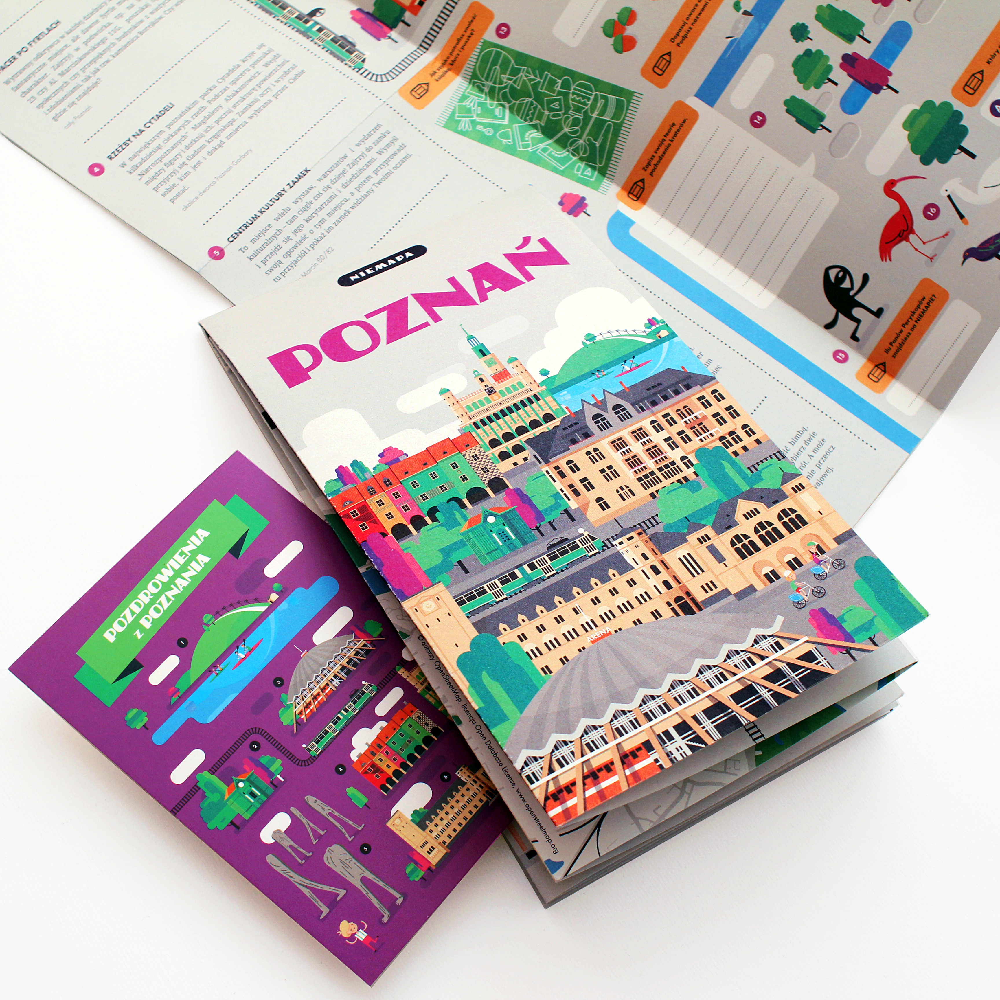

W 2016&nbsp;r. brałam udział w&nbsp;warsztatach -&nbsp;service jamie organizowanych przez <a href="https://www.concordiadesign.pl">Concordia Design</a>. Była to okazja do uczestnictwa w&nbsp;tworzeniu nowego produktu –&nbsp;<a href="http://niemapa.pl/poznan/">NieMAPY</a> z&nbsp;wykorzystaniem elementów metodologii design thinking. Celem warsztatów było znalezienie odpowiedzi na pytanie: Jak określić potencjał NieMAPY w&nbsp;sposób komercyjny i&nbsp;społeczny?

Service jam poprowadziły: współtwórczyni NieMAPY -&nbsp;Małgorzata Żmijska oraz trenerka kreatywności Sylwia Hull Wosiek. Zespół był różnorodny, multidyscyplinarny i&nbsp;wielopokoleniowy. W&nbsp;zgłoszeniu należało napisać kilka słów o&nbsp;sobie, swojej pracy lub studiach i&nbsp;o&nbsp;tym, dlaczego chcemy wziąć udział w&nbsp;service jamie. 

<h2>O projekcie</h2>

NieMAPA to wyjątkowo zaprojektowana seria ilustrowanych przewodników po mieście, która pokazuje opisuje ciekawe i&nbsp;nieznane miejsca. NieMAPA odkrywa Poznań na nowo, opisuje i&nbsp;ilustruje znane i&nbsp;nieznane miejsca, wyznacza nowe szlaki, przypomina o&nbsp;parkach, ogrodach czy urokliwych zakątkach. Spacer z&nbsp;NieMAPĄ, obfituje w&nbsp;zabawy związane z&nbsp;miastem, jego kulturą, historią i&nbsp;tym niepowtarzalnym charakterem. To doskonała propozycja na spędzenie weekendu z&nbsp;dziećmi, a&nbsp;także na hipsterskie odkrywanie miasta w&nbsp;alternatywny sposób.

	

<ul class="gallery">
	<li class="item" href="../assets/projects/concordia-design/0.jpg" style="background-image: url(../assets/projects/concordia-design/0.jpg);"></li>
	<li class="item" href="../assets/projects/concordia-design/1.jpg" style="background-image: url(../assets/projects/concordia-design/1.jpg);"></li>
	<li class="item" href="../assets/projects/concordia-design/2.jpg" style="background-image: url(../assets/projects/concordia-design/2.jpg);"></li>
	<li class="item" href="../assets/projects/concordia-design/3.jpg" style="background-image: url(../assets/projects/concordia-design/3.jpg);"></li>
	<li class="item" href="../assets/projects/concordia-design/4.jpg" style="background-image: url(../assets/projects/concordia-design/4.jpg);"></li>
	<li class="item" href="../assets/projects/concordia-design/5.jpg" style="background-image: url(../assets/projects/concordia-design/5.jpg);"></li>
</ul>