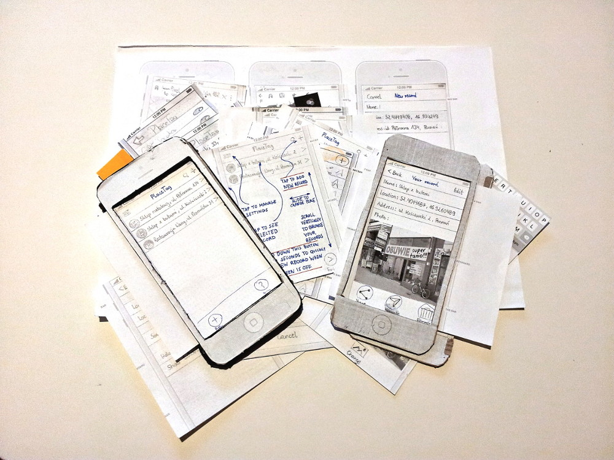

W pierwszym kwartale 2016 roku podjęłam się pracy nad projektem <a href="http://placetag.pl">Placetag.pl</a>&nbsp;w&nbsp;ramach poprawy jego użyteczności. Pierwszym krokiem było określenie strategii finansowej, uwzględniającej model biznesowy.

Wraz z&nbsp;całym zespołem zdefiniowaliśmy podstawowy segment klientów oraz określiliśmy problem z&nbsp;jakim użytkownicy się borykają. To umożliwiło opracowanie prowizorycznych profili klientów. W&nbsp;celu weryfikacji początkowej propozycji wartości rozwiązania przeprowadziłam badania zorientowane na rozpoznanie rynku z&nbsp;udziałem klientów.

Kolejnym, równie ważnym krokiem była analiza konkurencji oraz identyfikacja okazji rynkowych. Przez cały ten etap zespół miał wgląd do dokumentacji i&nbsp;mógł zgłaszać uwagi. W&nbsp;rezultacie udało się określić innowację wyróżniającą projekt.

Przygotowałam również nowe prototypy aplikacji webowej oraz mobilnej, a&nbsp;następnie przedstawiłam je pozostałym członkom zespołu. Po ich zatwierdzeniu przeprowadziłam testy użyteczności z&nbsp;wykorzystaniem papierowego prototypu aplikacji mobilnej. Uzyskane informacje umożliwiły stworzenie końcowego interfejsu oraz jego struktury.

<h2>O projekcie</h2>

Placetag jest projektem inżynierskim zrealizowany na Wydziale Informatyki i&nbsp;Matematyki UAM w&nbsp;Poznaniu. Placetag to webowa oraz mobilna aplikacja pozwalająca w prosty sposób zapisywać miejsca, które chcielibyśmy odwiedzić w późniejszym czasie. Użytkownik aplikacji może katalogować zapisane miejsca za pomocą tagów oraz kategorii, a&nbsp;także udostępniać miejsca ze swoimi znajomymi.

	

<ul class="gallery">
	<li class="item" href="../assets/projects/placetag/4.jpg" style="background-image: url(../assets/projects/placetag/4.jpg);"></li>
	<li class="item" href="../assets/projects/placetag/0.jpg" style="background-image: url(../assets/projects/placetag/0.jpg);"></li>
	<li class="item" href="../assets/projects/placetag/1.jpg" style="background-image: url(../assets/projects/placetag/1.jpg);"></li>
	<li class="item" href="../assets/projects/placetag/2.jpg" style="background-image: url(../assets/projects/placetag/2.jpg);"></li>
	<li class="item" href="../assets/projects/placetag/3.jpg" style="background-image: url(../assets/projects/placetag/3.jpg);"></li>
	<li class="item" href="../assets/projects/placetag/6.jpg" style="background-image: url(../assets/projects/placetag/6.jpg);"></li>
	<li class="item" href="../assets/projects/placetag/7.jpg" style="background-image: url(../assets/projects/placetag/7.jpg);"></li>
</ul>
