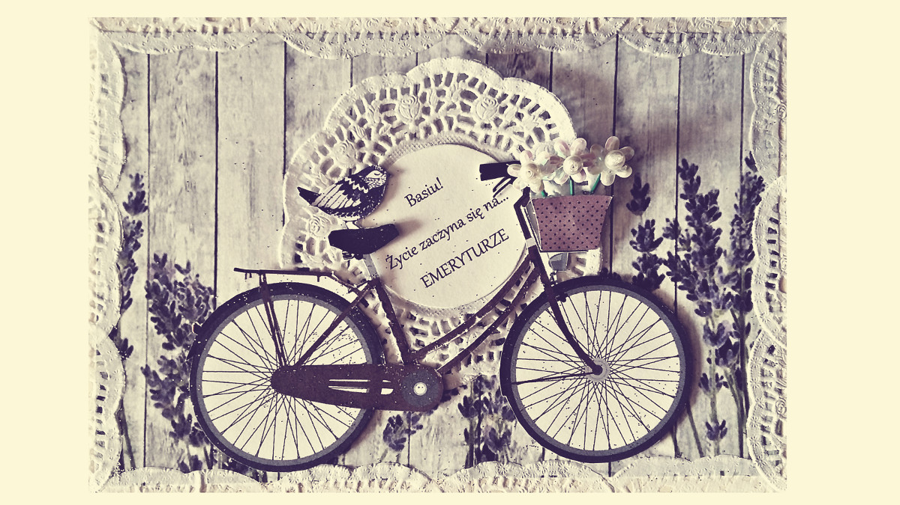

<i>„Wartość ma nie tylko sam podarunek, ale też sposób, w&nbsp;jaki zostanie ofiarowany.”</i> ~Hans Christian Andersen

Uwielbiam przygotowywać prezenty, a&nbsp;jeszcze lepiej kiedy wyglądają one oryginalnie. Tworzenie spersonalizowanych kartek oraz opakowań na prezenty, które następnie wręczam bliskim mi osobom, sprawia mi niezwykłą radość. Poniżej zamieściłam kilka przykładowych zdjęć mojej pasji.

	

<ul class="gallery">
	<li class="item" href="../assets/projects/scrapbooking/1.jpg" style="background-image: url(../assets/projects/scrapbooking/1.jpg);"></li>
	<li class="item" href="../assets/projects/scrapbooking/2.jpg" style="background-image: url(../assets/projects/scrapbooking/2.jpg);"></li>
	<li class="item" href="../assets/projects/scrapbooking/3.jpg" style="background-image: url(../assets/projects/scrapbooking/3.jpg);"></li>
	<li class="item" href="../assets/projects/scrapbooking/4.jpg" style="background-image: url(../assets/projects/scrapbooking/4.jpg);"></li>
	<li class="item" href="../assets/projects/scrapbooking/5.jpg" style="background-image: url(../assets/projects/scrapbooking/5.jpg);"></li>
</ul>

<link rel="stylesheet" href="../assets/scripts/gallery/luminous-basic.min.css" />
