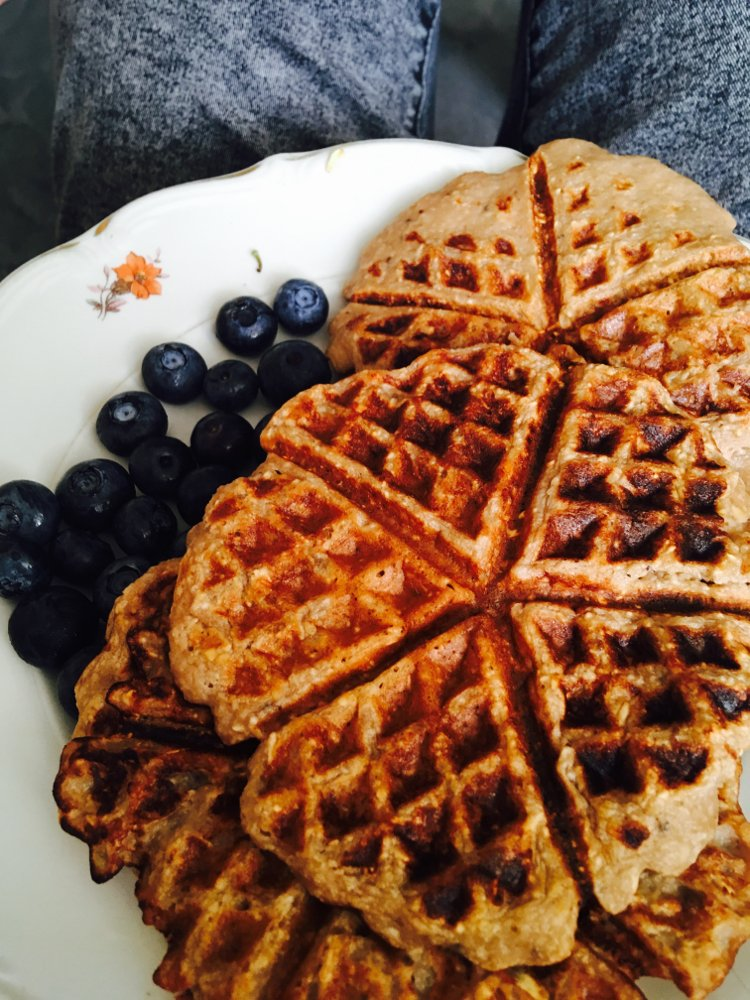

W&nbsp;kwietniu 2018&nbsp;r. rozpoczęła się moja przygoda zdrowszego i&nbsp;szczęśliwszego życia. Podjęłam wyzwanie i&nbsp;przeszłam na weganizm. Po części chciałam udowodnić sobie i&nbsp;rodzinie, że dam radę, ale najważniejszymi powodami były dla mnie etyka oraz zdrowie. Mimo, że to dopiero początki mogę śmiało powiedzieć, że nie wyobrażam sobie innego stylu życia.

Moje potrawy powstają z&nbsp;uwielbienia do kuchni roślinnej, jej smaków i&nbsp;aromatów, które są niebywale rozmaite. Bez produktów odzwierzęcych: żadnego mleka, mięsa, czy śmietany. Moje kuchnia opiera się na świeżych, sezonowych produktach i&nbsp;ciekawych połączeniach. Warzywa zamieniają się w&nbsp;pyszne desery, zaś główne dania zawsze są kolorowe i&nbsp;smaczne. Poza smakiem najważniejsza jest dla mnie estetyka podawania posiłków. Potrawy, które nam się podobają i&nbsp;wyglądają apetycznie, po prostu bardziej nam smakują.

Uważam, że trzeba się rozwijać, uczyć i&nbsp;zdobywać więcej. Sięgać do gwiazd i&nbsp;realizować swoje marzenia. Tylko tak możemy w&nbsp;życiu znaleźć drogę do prawdziwego szczęścia. Wierzę, że w przyszłości dania przygotowane przeze mnie będą na tyle intrygujące, że przekonają moich najbliższych, że kuchnia roślinna jest równie smaczna, co tradycyjna.

	

<ul class="gallery">
	<li class="item" href="../assets/projects/cooking/1.jpg" style="background-image: url(../assets/projects/cooking/1.jpg);"></li>
	<li class="item" href="../assets/projects/cooking/2.jpg" style="background-image: url(../assets/projects/cooking/2.jpg);"></li>
	<li class="item" href="../assets/projects/cooking/3.jpg" style="background-image: url(../assets/projects/cooking/3.jpg);"></li>
	<li class="item" href="../assets/projects/cooking/4.jpg" style="background-image: url(../assets/projects/cooking/4.jpg);"></li>
	<li class="item" href="../assets/projects/cooking/5.jpg" style="background-image: url(../assets/projects/cooking/5.jpg);"></li>
	<li class="item" href="../assets/projects/cooking/6.jpg" style="background-image: url(../assets/projects/cooking/6.jpg);"></li>
	<li class="item" href="../assets/projects/cooking/7.jpg" style="background-image: url(../assets/projects/cooking/7.jpg);"></li>
	<li class="item" href="../assets/projects/cooking/8.jpg" style="background-image: url(../assets/projects/cooking/8.jpg);"></li>
	<li class="item" href="../assets/projects/cooking/9.jpg" style="background-image: url(../assets/projects/cooking/9.jpg);"></li>
	<li class="item" href="../assets/projects/cooking/10.jpg" style="background-image: url(../assets/projects/cooking/10.jpg);"></li>
	<li class="item" href="../assets/projects/cooking/11.jpg" style="background-image: url(../assets/projects/cooking/11.jpg);"></li>
	<li class="item" href="../assets/projects/cooking/12.jpg" style="background-image: url(../assets/projects/cooking/12.jpg);"></li>
	<li class="item" href="../assets/projects/cooking/13.jpg" style="background-image: url(../assets/projects/cooking/13.jpg);"></li>
	<li class="item" href="../assets/projects/cooking/14.jpg" style="background-image: url(../assets/projects/cooking/14.jpg);"></li>
	<li class="item" href="../assets/projects/cooking/15.jpg" style="background-image: url(../assets/projects/cooking/15.jpg);"></li>
	<li class="item" href="../assets/projects/cooking/16.jpg" style="background-image: url(../assets/projects/cooking/16.jpg);"></li>
	<li class="item" href="../assets/projects/cooking/17.jpg" style="background-image: url(../assets/projects/cooking/17.jpg);"></li>
	<li class="item" href="../assets/projects/cooking/18.jpg" style="background-image: url(../assets/projects/cooking/0.jpg);"></li>
	<li class="item" href="../assets/projects/cooking/19.jpg" style="background-image: url(../assets/projects/cooking/19.jpg);"></li>
	<li class="item" href="../assets/projects/cooking/20.jpg" style="background-image: url(../assets/projects/cooking/20.jpg);"></li>
	<li class="item" href="../assets/projects/cooking/21.jpg" style="background-image: url(../assets/projects/cooking/21.jpg);"></li>
	<li class="item" href="../assets/projects/cooking/22.jpg" style="background-image: url(../assets/projects/cooking/22.jpg);"></li>
	<li class="item" href="../assets/projects/cooking/23.jpg" style="background-image: url(../assets/projects/cooking/23.jpg);"></li>
	<li class="item" href="../assets/projects/cooking/24.jpg" style="background-image: url(../assets/projects/cooking/24.jpg);"></li>
	<li class="item" href="../assets/projects/cooking/25.jpg" style="background-image: url(../assets/projects/cooking/25.jpg);"></li>
	<li class="item" href="../assets/projects/cooking/26.jpg" style="background-image: url(../assets/projects/cooking/26.jpg);"></li>
</ul>
