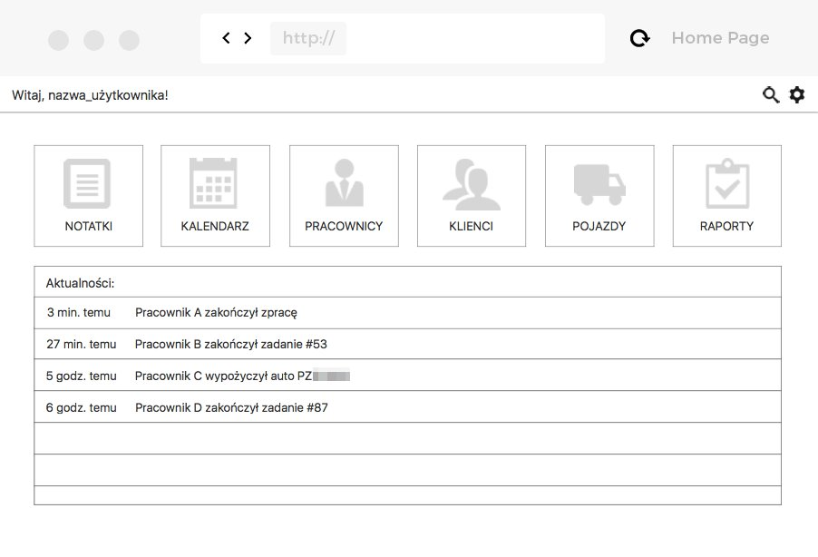
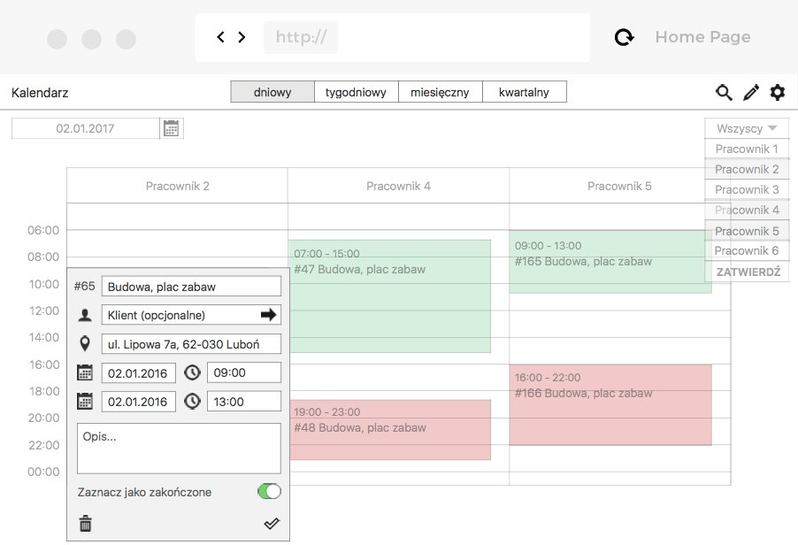
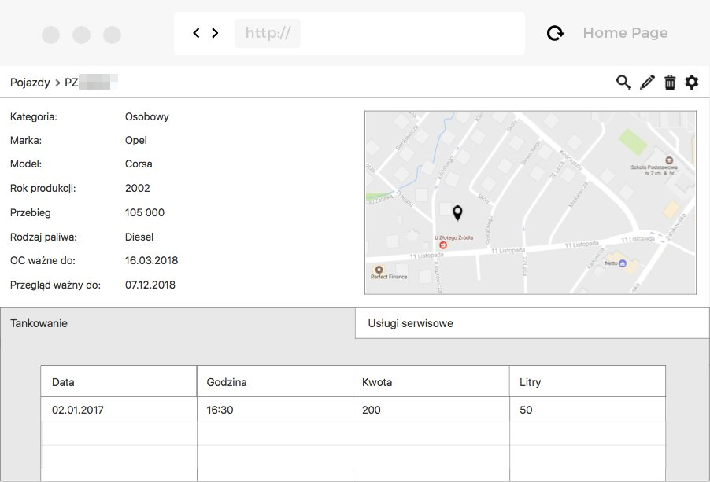

Jednym z&nbsp;projektów, jakie przygotowałam dla <a target="_blank" href="https://flow2code.com/">Flow2code</a> było zaprojektowanie prototypów aplikacji dla firmy <a target="_blank" href="http://sun-plus.pl/">Sun+</a>. Czas realizacji projektu był bardzo ograniczony, w&nbsp;związku z&nbsp;czym niezwykle istotne było stworzenie harmonogramu zadań, uwzględniającego hierarchię poszczególnych etapów. Estymowanie zadań jest pomocne przy tzw.&nbsp;projektach „na wczoraj”. Ważne, by presja czasu nie oddziaływała negatywnie na naszą pracę, a&nbsp;była naszym motywatorem. Dzięki planowaniu swojej pracy wiem ile potrzebuję czasu na wykonanie danego zadania.

Pierwszym krokiem była analiza wymagań klienta, jakie musi spełniać poszukiwanie rozwiązanie. Aplikacja miała pełnić funkcję oprogramowania CRM, optymalizując procesy zachodzące pomiędzy firmą a&nbsp;jej pracownikami. Sformułowane wnioski stanowiły podstawę do etapu projektowania.

Pierwszym narzędziem, po które sięgnęłam była zwykła kartka A4 i&nbsp;długopis. Jest to najtańszy i&nbsp;najszybszy sposób wizualizacji pomysłów. Kolejnym krokiem było przeniesienie mockupów do programu, czego efektem są przedstawione poniżej screeny. Ze względu na ograniczony czas realizacji projektu, najważniejsze w&nbsp;tym przypadku było rozmieszczenie poszczególnych elementów.

	

	

	

