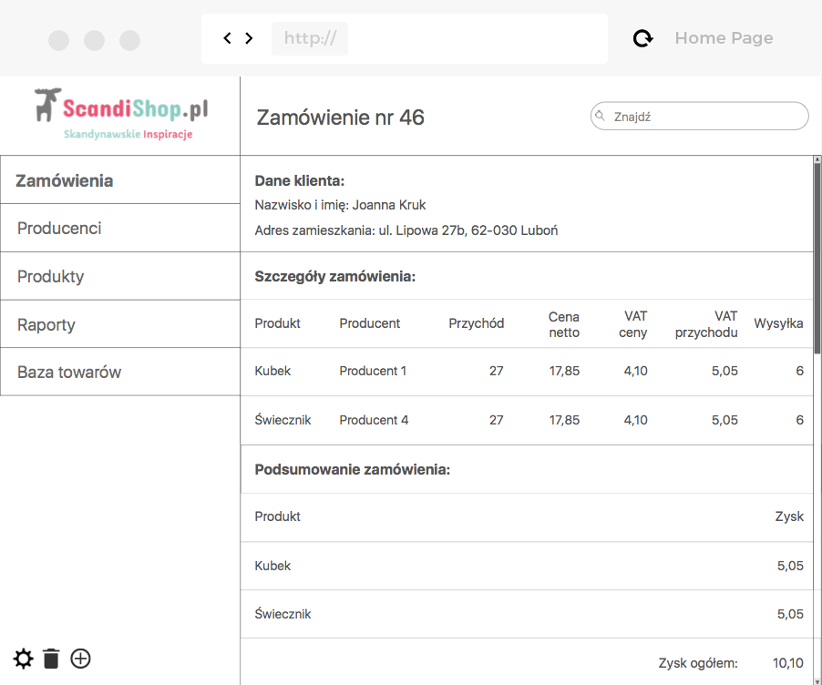
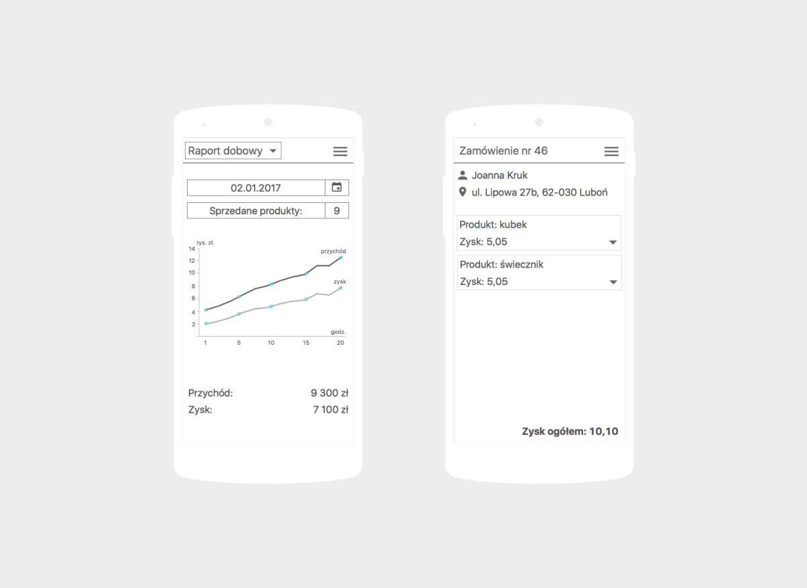
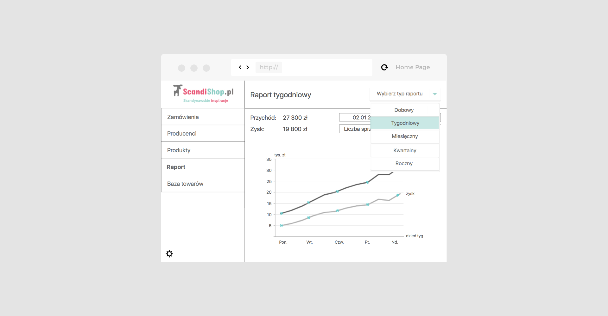
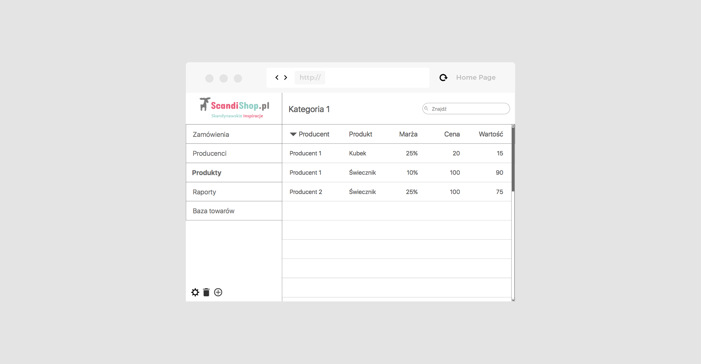

Mockup CMS dla <a href="https://www.scandishop.pl/">ScandiShop.pl</a> był kolejnym projektem wykonywanym w&nbsp;ramach <a href="https://flow2code.com/">Flow2code</a>. Moim zadaniem było zaprojektowanie aplikacji webowej, uwzględniając przy tym zasady responsive web design. Ważne było, aby zaprojektowane ekrany dostosowywały się do wielkości okna przeglądarki wszystkich urządzeń.

Kompleksowa analiza wymagań klienta oraz określenie z&nbsp;jakim problemami się boryka umożliwiła ocenę przygotowanej wcześniej propozycji wartości. Interesariuszowi zależało na stworzeniu prostego CMSu do liczenia wydatków i&nbsp;przychodów. Największą zaletą zaprojektowanej aplikacji jest spersonalizowanie oraz działanie zgodnie z&nbsp;potrzebami określonymi przez klienta, który chciał mieć wszystkie najważniejsze informacje odnośnie swojego internetowego sklepu w&nbsp;jednym miejscu. Uzyskane informacje stanowiły bazę do zaprojektowania mockupów dla ScandiShop.pl, których część została przedstawiona poniżej.

	

	

	

	

