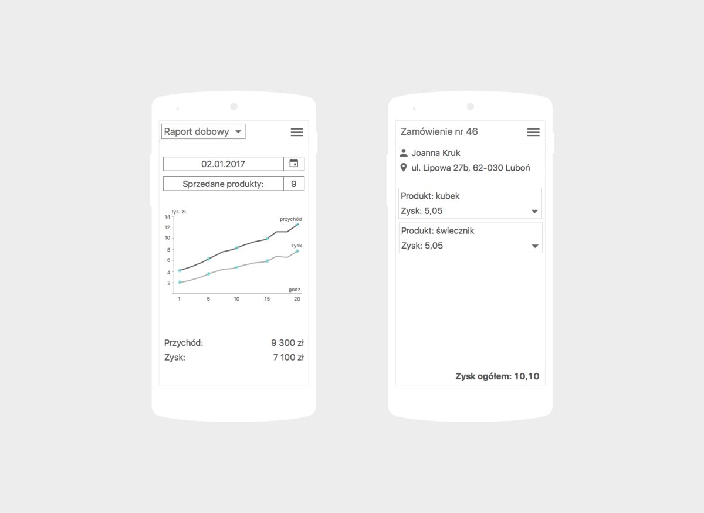

Mockup <a target="_blank" href="https://flow2code.com/systems/scandishop/auth/login">CRM</a> dla <a target="_blank" href="https://www.scandishop.pl/">ScandiShop.pl</a> był kolejnym projektem wykonywanym w&nbsp;ramach <a target="_blank" href="https://flow2code.com/">Flow2code</a>. Moim zadaniem było zaprojektowanie aplikacji webowej, uwzględniając przy tym zasady responsive web design. Ważne było, aby zaprojektowane ekrany dostosowywały się do wielkości okna przeglądarki wszystkich urządzeń.

Kompleksowa analiza wymagań klienta oraz określenie z&nbsp;jakim problemami się boryka umożliwiła przygotowanie makiety spełniającej oczekiwane funkcjonalności. Interesariuszowi zależało na stworzeniu prostego systemu CRM do liczenia wydatków i&nbsp;przychodów. Głównym założeniem aplikacji było przeniesienie wszystkich dostępnych danych o&nbsp;prowadzonym sklepie w&nbsp;jedno miejsce. Pozyskane informacje stanowiły bazę do zaprojektowania mockupów dla ScandiShop.pl, których część została przedstawiona poniżej.

	

<ul class="gallery">
	<li class="item" href="../assets/projects/flow2code/scandishop/1.jpg" style="background-image: url(../assets/projects/flow2code/scandishop/1.jpg);"></li>
	<li class="item" href="../assets/projects/flow2code/scandishop/2.jpg" style="background-image: url(../assets/projects/flow2code/scandishop/2.jpg);"></li>
	<li class="item" href="../assets/projects/flow2code/scandishop/3.jpg" style="background-image: url(../assets/projects/flow2code/scandishop/3.jpg);"></li>
</ul>
