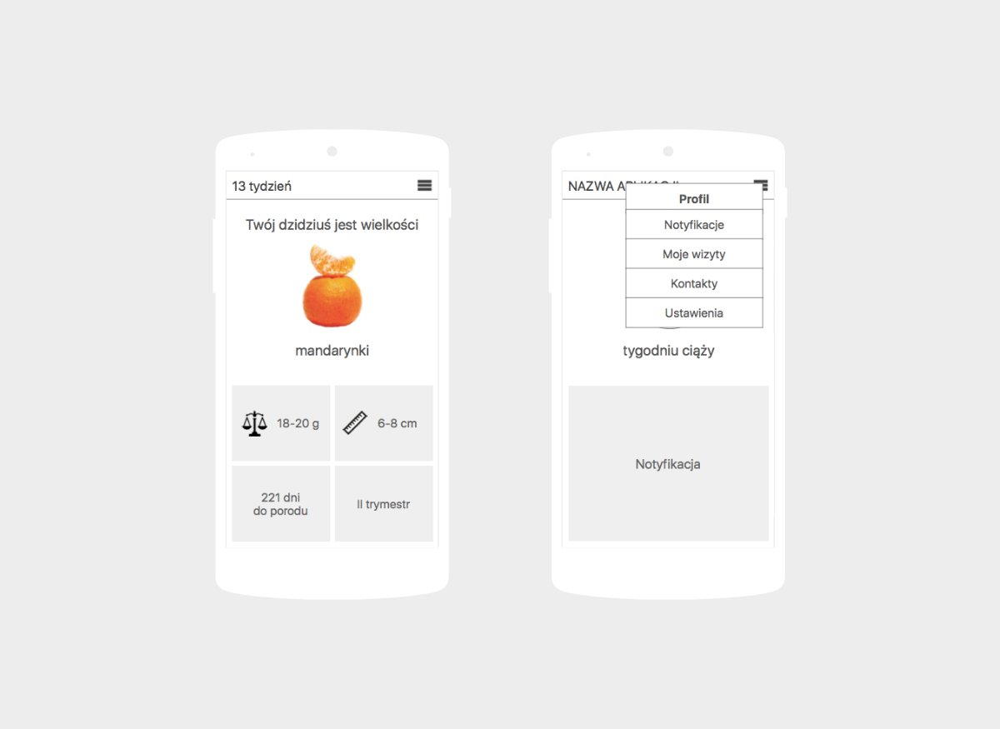
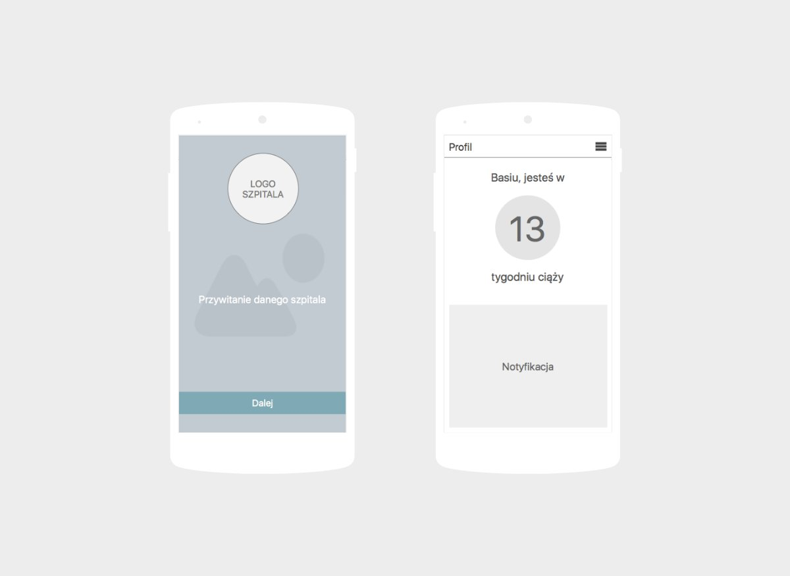

Kolejnym projektem, jaki przygotowałam dla firmy <a target="_blank" href="https://flow2code.com/">Flow2code</a>, była makieta aplikacji mobilnej dla ciężarnych kobiet. Przygotowane mockupy zostały wykorzystane jako uzupełnienie dokumentacji przetargowej. W&nbsp;drodze przetargu zostały wyłonione dwie firmy do realizacji, w&nbsp;tym Flow2code.

Fundacja dla kobiet w&nbsp;ciąży w&nbsp;Niemczech we współpracy z&nbsp;niemieckimi szpitalami chciała zbudować platformę edukacyjną dla swoich brzemiennych pacjentek. Celem aplikacji mobilnej jest towarzyszenie kobietom w&nbsp;ciąży w&nbsp;tym najtrudniejszym momencie w&nbsp;ich życiu, edukować je oraz budować image szpitali, jako nieodzownego partnera ciężarnych kobiet.

Aplikację miała wyróżniać prostota – jest to swego rodzaju elektroniczna ulotka dla kobiet w&nbsp;ciąży. Pacjentki miały otrzymywać powiadomienia odnośnie swojej ciąży od danego szpitala, który polecił im tę aplikację.

Zanim przystąpiłam do budowy rozwiązania, musiałam się dowiedzieć więcej o przyszłych użytkowniczkach aplikacji. Dlaczego? Ponieważ budowanie nowego i&nbsp;innowacyjnego produktu wyłącznie na podstawie przeczuć jest wysoce ryzykownym przedsięwzięciem. W&nbsp;kolejnym kroku przeprowadziłam badania rynku pod kątem analizy konkurencji. Najpierw poszukałam konkurentów bezpośrednich, czyli produktów, których propozycja wartości praktycznie pokrywa się z&nbsp;moją, a&nbsp;następnie konkurentów pośrednich. Analiza wszystkich zebranych dotychczas informacji stanowiła podstawę do stworzenia mockupów aplikacji mobilnej, których część z&nbsp;nich zaprezentowano poniżej.

	

	

