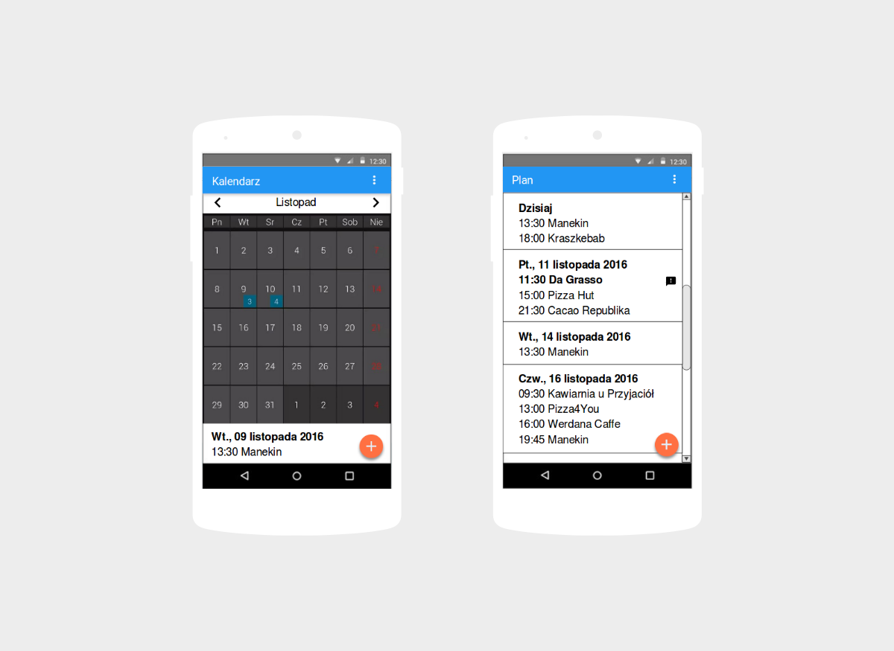
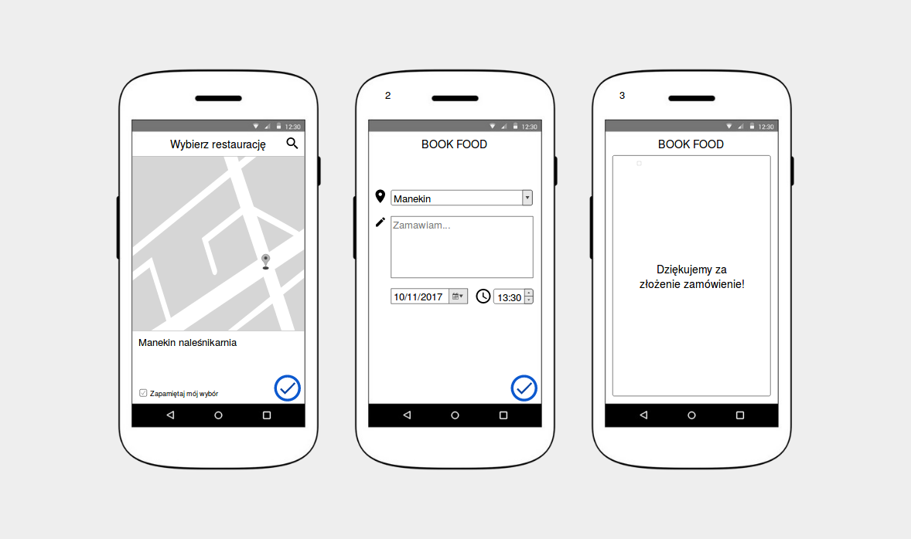

Mockup aplikacji BookFood był pierwszym projektem, jaki stworzyłam w&nbsp;ramach pracy dla <a href="https://flow2code.com/">Flow2code</a>. Punktem wyjścia było wskazanie problemu, który zamierzałam rozwiązać, a&nbsp;następnie zastanowienie się, jakiego rodzaju klienci odczuwają najsilniejszą potrzebę rozwiązania tego problemu.

Wywiad konkurencyjny umożliwił sformułowanie wniosków wkwestii tego, co się sprawdza, dlaczego to się sprawdza oraz jakie okazje kryje rynek dla naszego produktu. Nie zależało mi na wprowadzeniu produktu, który tylko kopiowałby wszystkie funkcje i&nbsp;cechy oferowane przez konkurentów. Nie zależało mi również na tym, aby moja analiza sprowadzała się do zwykłego porównania cech produktów konkurencyjnych. Moim zadaniem było poddanie wszystkiego analizie i&nbsp;wskazanie najważniejszych funkcji i możliwości, które pozwolą stworzyć jakąś innowację w&nbsp;zakresie wartości. Chcieliśmy zostawić konkurentów daleko w&nbsp;tyle proponując coś wyjątkowego, co będzie wyraźnie lepsze od ich dotychczasowej oferty. Podstawowym zadaniem propozycji wartości było informowanie klienta o&nbsp;korzyściach, których może się spodziewać, wybierając naszą ofertę. Wszystkie uzyskane dotychczas dane stanowiły bazę do zaprojektowania aplikacji.

	

	

