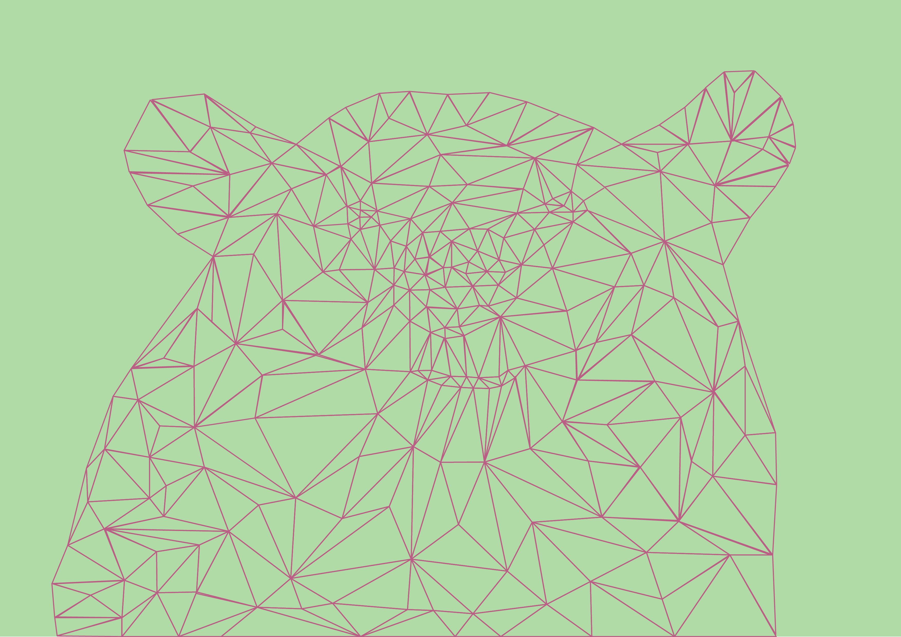
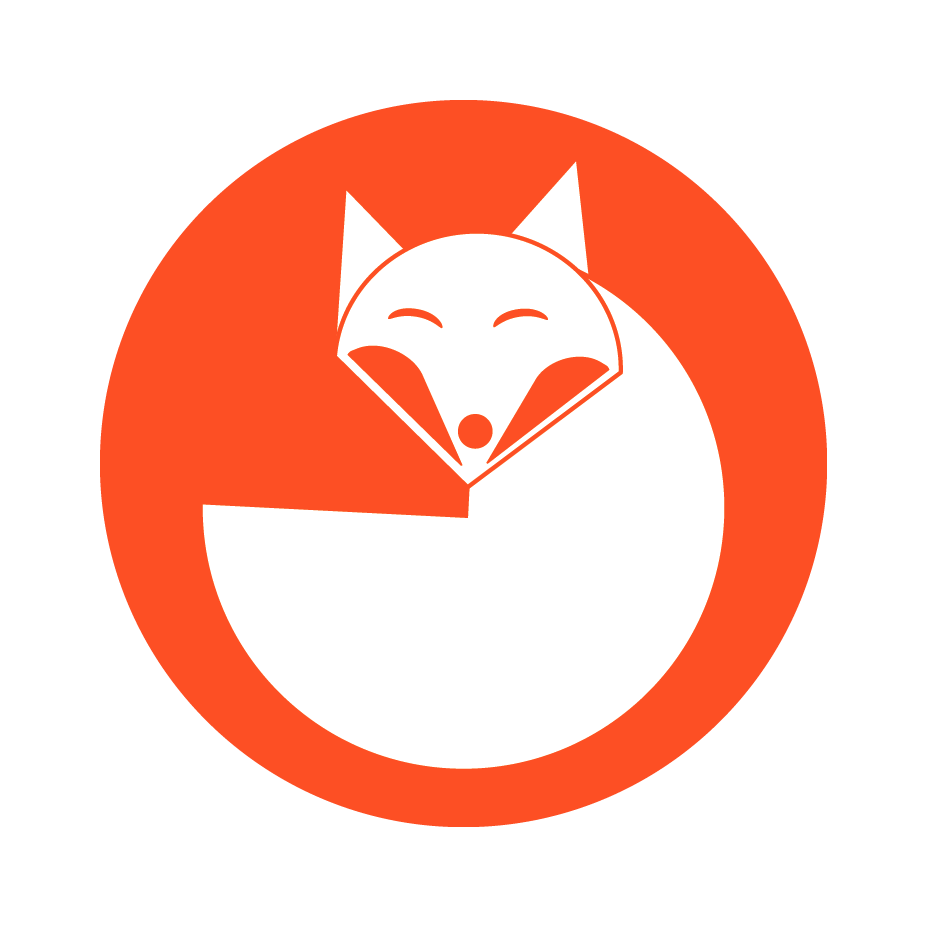

W wolnym czasie lubię szkicować oraz rysować zarówno na zwykłej kartce papieru jak i&nbsp;w&nbsp;programach przeznaczonych głównie do tworzenia grafiki wektorowej. Poniżej zamieściłam kilka moich prac.

Oprócz tradycyjnego rysowania, w&nbsp;wolnym czasie lubię również tworzyć w&nbsp;programach przeznaczonych do grafiki wektorowej. Jest to jedna z&nbsp;moich pasji. Grafiki tworzę głównie w&nbsp;Adobe Illustrator&nbsp;CC. Uwielbiam rysować geometryczne podobizny zwierząt. Część z&nbsp;przedstawionych poniżej prac została wykonana w&nbsp;ramach studiów na Uniwersytecie im.&nbsp;Adama Mickiewicza w&nbsp;Poznaniu na kierunku Gospodarka Przestrzenna.

Do danego projektu warto podejść z&nbsp;głową, żeby później nie mieć poczucia straconego czasu. Odpowiedni plan działania nie zaszkodzi, a&nbsp;może jedynie nas uchronić od dodatkowych poprawek. Kilka przykładowych prac zamieściłam poniżej.

	

	

	

	

	

	

	

	

	

