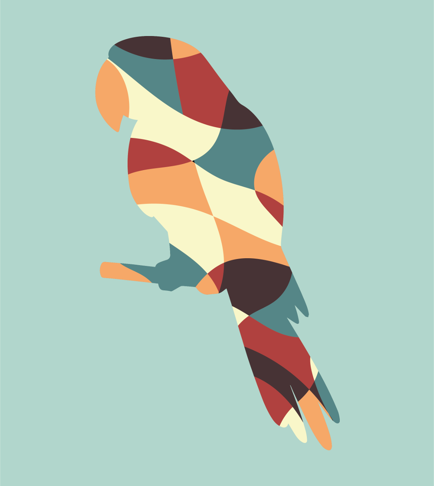

Oprócz tradycyjnego rysowania, w&nbsp;wolnym czasie lubię również tworzyć w&nbsp;programach przeznaczonych do grafiki wektorowej. Jest to jedna z&nbsp;moich pasji. Grafiki tworzę głównie w&nbsp;Adobe Illustrator&nbsp;CC. Uwielbiam rysować geometryczne podobizny zwierząt. Część z&nbsp;przedstawionych poniżej prac została wykonana w&nbsp;ramach studiów na Uniwersytecie im.&nbsp;Adama Mickiewicza w&nbsp;Poznaniu na kierunku Gospodarka Przestrzenna.

Do danego projektu warto podejść z&nbsp;głową, żeby później nie mieć poczucia straconego czasu. Odpowiedni plan działania nie zaszkodzi, a&nbsp;może jedynie nas uchronić od dodatkowych poprawek. Kilka przykładowych prac zamieściłam poniżej.

	

<ul class="gallery">
	<li class="item" href="../assets/projects/graphics/1.jpg" style="background-image: url(../assets/projects/graphics/1.jpg);"></li>
	<li class="item" href="../assets/projects/graphics/1.png" style="background-image: url(../assets/projects/graphics/1.png);"></li>
	<li class="item" href="../assets/projects/graphics/2.jpg" style="background-image: url(../assets/projects/graphics/2.jpg);"></li>
	<li class="item" href="../assets/projects/graphics/3.jpg" style="background-image: url(../assets/projects/graphics/3.jpg);"></li>
	<li class="item" href="../assets/projects/graphics/4.jpg" style="background-image: url(../assets/projects/graphics/4.jpg);"></li>
	<li class="item" href="../assets/projects/graphics/5.jpg" style="background-image: url(../assets/projects/graphics/5.jpg);"></li>
	<li class="item" href="../assets/projects/graphics/6.jpg" style="background-image: url(../assets/projects/graphics/6.jpg);"></li>
	<li class="item" href="../assets/projects/graphics/7.jpg" style="background-image: url(../assets/projects/graphics/7.jpg);"></li>
	<li class="item" href="../assets/projects/graphics/8.jpg" style="background-image: url(../assets/projects/graphics/8.jpg);"></li>
	<li class="item" href="../assets/projects/graphics/9.jpg" style="background-image: url(../assets/projects/graphics/9.jpg);"></li>
	<li class="item" href="../assets/projects/graphics/10.jpg" style="background-image: url(../assets/projects/graphics/10.jpg);"></li>
	<li class="item" href="../assets/projects/graphics/11.jpg" style="background-image: url(../assets/projects/graphics/11.jpg);"></li>
	<li class="item" href="../assets/projects/graphics/12.jpg" style="background-image: url(../assets/projects/graphics/12.jpg);"></li>
	<li class="item" href="../assets/projects/graphics/13.jpg" style="background-image: url(../assets/projects/graphics/13.jpg);"></li>
	<li class="item" href="../assets/projects/graphics/14.jpg" style="background-image: url(../assets/projects/graphics/14.jpg);"></li>
	<li class="item" href="../assets/projects/graphics/15.jpg" style="background-image: url(../assets/projects/graphics/15.jpg);"></li>
	<li class="item" href="../assets/projects/graphics/16.jpg" style="background-image: url(../assets/projects/graphics/16.jpg);"></li>
	<li class="item" href="../assets/projects/graphics/17.jpg" style="background-image: url(../assets/projects/graphics/17.jpg);"></li>
	<li class="item" href="../assets/projects/graphics/18.jpg" style="background-image: url(../assets/projects/graphics/18.jpg);"></li>
	<li class="item" href="../assets/projects/graphics/19.jpg" style="background-image: url(../assets/projects/graphics/19.jpg);"></li>
	<li class="item" href="../assets/projects/graphics/20.jpg" style="background-image: url(../assets/projects/graphics/20.jpg);"></li>
	<li class="item" href="../assets/projects/graphics/21.jpg" style="background-image: url(../assets/projects/graphics/21.jpg);"></li>
	<li class="item" href="../assets/projects/graphics/22.jpg" style="background-image: url(../assets/projects/graphics/22.jpg);"></li>
	<li class="item" href="../assets/projects/graphics/23.jpg" style="background-image: url(../assets/projects/graphics/23.jpg);"></li>
	<li class="item" href="../assets/projects/graphics/24.jpg" style="background-image: url(../assets/projects/graphics/24.jpg);"></li>
	<li class="item" href="../assets/projects/graphics/25.jpg" style="background-image: url(../assets/projects/graphics/25.jpg);"></li>
	<li class="item" href="../assets/projects/graphics/26.jpg" style="background-image: url(../assets/projects/graphics/26.jpg);"></li>
	<li class="item" href="../assets/projects/graphics/27.jpg" style="background-image: url(../assets/projects/graphics/27.jpg);"></li>
</ul>