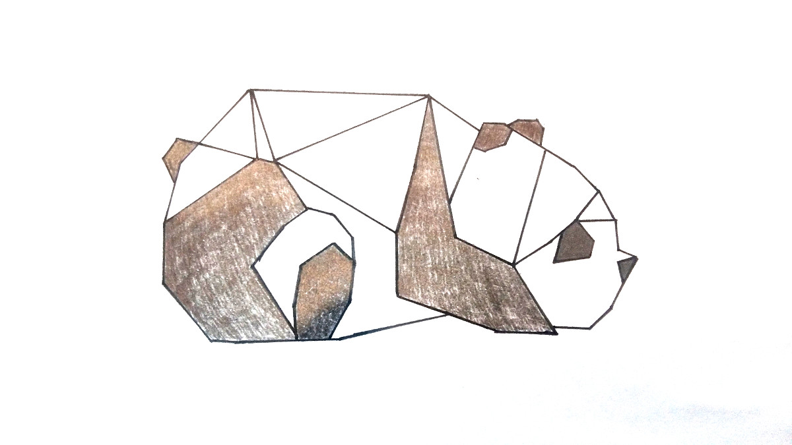

Każdy potrzebuje odskoczni od codziennej rutyny. Jedni wybierają sport, inni uciekają w filmowy lub serialowy świat, niektórzy zaś tworzą sobie własną rzeczywistość, choćby na zwykłym papierze. Rysowanie mnie uspokoją i&nbsp;niesamowicie poprawia mi humor. Czasem zdarzają się się jednak takie momenty, gdzie kompletnie nie umiem się do tego zabrać, ale prędzej czy później pojawia się pomysł i&nbsp;wtedy wiem, że powstanie coś fajnego –&nbsp;coś mojego. Poniżej zamieściłam kilka swoich prac.

	

<ul class="gallery">
	<li class="item" href="../assets/projects/sketchs/1.jpg" style="background-image: url(../assets/projects/sketchs/1.jpg);"></li>
	<li class="item" href="../assets/projects/sketchs/2.jpg" style="background-image: url(../assets/projects/sketchs/2.jpg);"></li>
	<li class="item" href="../assets/projects/sketchs/3.jpg" style="background-image: url(../assets/projects/sketchs/3.jpg);"></li>
	<li class="item" href="../assets/projects/sketchs/4.jpg" style="background-image: url(../assets/projects/sketchs/4.jpg);"></li>
	<li class="item" href="../assets/projects/sketchs/5.jpg" style="background-image: url(../assets/projects/sketchs/5.jpg);"></li>
	<li class="item" href="../assets/projects/sketchs/6.jpg" style="background-image: url(../assets/projects/sketchs/6.jpg);"></li>
	<li class="item" href="../assets/projects/sketchs/7.jpg" style="background-image: url(../assets/projects/sketchs/7.jpg);"></li>
	<li class="item" href="../assets/projects/sketchs/8.jpg" style="background-image: url(../assets/projects/sketchs/8.jpg);"></li>
</ul>

<link rel="stylesheet" href="../assets/scripts/gallery/luminous-basic.min.css" />
