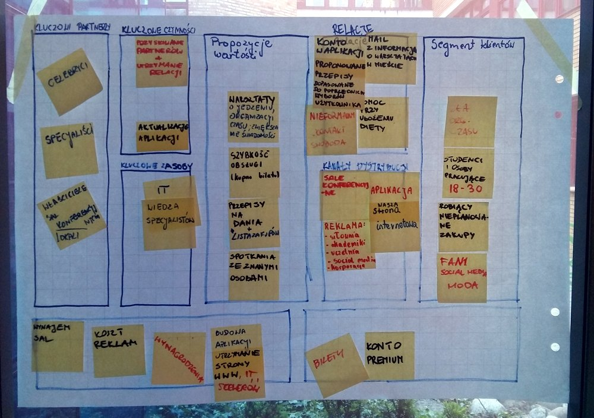
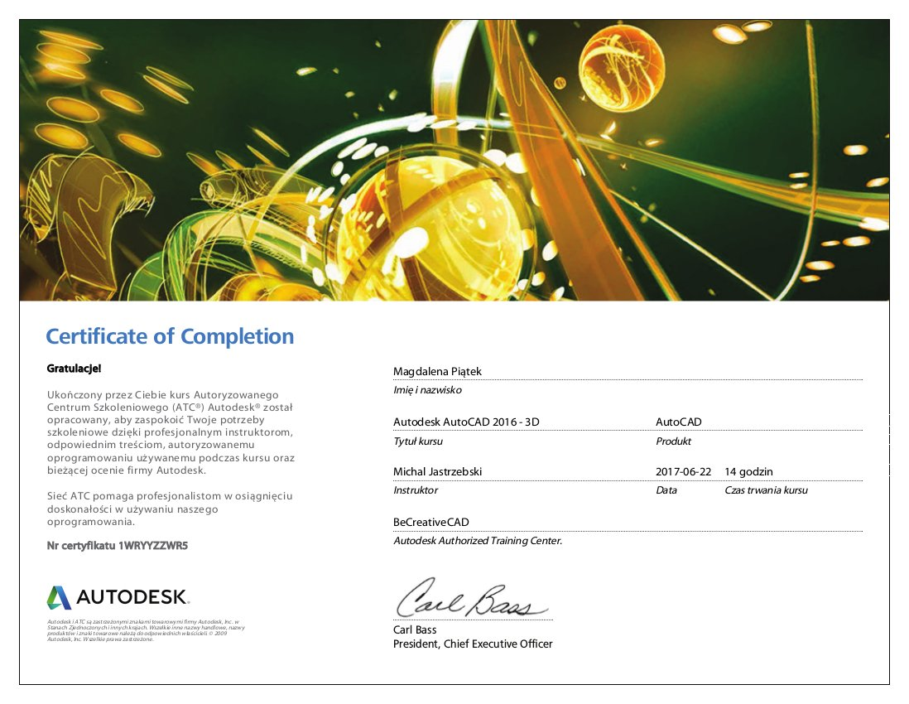

„<a target="_blank" href="http://geocentrum.home.amu.edu.pl/">Geocentrum Doskonałości</a>” to autorski program dostosowywania umiejętności studentów Wydziału Nauk Geograficznych i&nbsp;Geologicznych Uniwersytetu im. Adama Mickiewicza do współczesnych wymagań rynku pracy. Projekt uzyskał dofinansowanie w&nbsp;ramach Programu Operacyjnego Wiedza Edukacja Rozwój 2014-2020. Wachlarz warsztatów był bardzo szeroki, od rozwoju umiejętności interpersonalnych, kompetencji językowych, specjalistycznych kompetencji zawodowych po podniesienie umiejętności wykorzystania narzędzi informatycznych czy zwiększenie kompetencji analitycznych i&nbsp;samoorganizacji.

	

Celem jednych z&nbsp;zajęć było nabycie wiedzy i&nbsp;praktycznych umiejętności w&nbsp;zakresie przedsiębiorczości. Obejmowały one m.in. diagnozowanie potrzeb klienta, analizę rynku i&nbsp;tworzenie profili klienta, generowanie pomysłów biznesowych oraz ich prototypowanie i&nbsp;testowanie. Ponadto, zajęcia dotyczyły także zagadnień dotyczących segmentacji rynku, relacji z&nbsp;klientem, identyfikacji strumieni przychodów, sieci partnerskich, kluczowych działań, kluczowych zasobów oraz struktury kosztów.

	

Warsztaty „Środowisko cad w rysunku projektowym -&nbsp;zaawansowane metody AUTOCAD” obejmował poszerzenie wiedzy z&nbsp;zakresu metod opracowywania rysunków projektowych oraz kształtowanie umiejętności wykorzystania w&nbsp;tym zakresie zaawansowanych funkcjonalności programu. Zajęcia były prowadzone przez Roberta Hoffmanna (UAM) oraz autoryzowanegp trenera AUTODESK –&nbsp;Michała Jastrzębskiego.

	

Kolejny z&nbsp;projektów został wykonany w&nbsp;ramach zajęć „Planowania przestrzenne na poziomie lokalnym” we współpracy z&nbsp;Kancelarią Urbanistyczną Filip Koczorowski. Celem warsztatów był rozwój specjalistycznych kompetencji zawodowych oraz samoorganizacji w&nbsp;zakresie umiejętności planowania i&nbsp;twórczego rozwiązywania problemów poprzez wykonanie koncepcji zagospodarowania przestrzennego oraz miejscowego planu zagospodarowania przestrzennego wybranego obszaru zlokalizowanego w&nbsp;Żydowie. Cała praca została uprzedzona jednodniowym wyjazdem studialnym w&nbsp;teren, który był przedmiotem projektowania. Pozwoliło to na przeprowadzenie dokładnej inwentaryzacji, którą przedstawia jedna z&nbsp;plansz. Jako, że cały projekt został przeniesiony z&nbsp;kalki na komputer zajęcia pozwoliły również na podniesienie umiejętności wykorzystania specjalistycznych programów komputerowych.

<ul class="gallery">
	<li class="item" href="../assets/projects/geocentrum/2.jpg" style="background-image: url(../assets/projects/geocentrum/2.jpg);"></li>
	<li class="item" href="../assets/projects/geocentrum/1.jpg" style="background-image: url(../assets/projects/geocentrum/1.jpg);"></li>
	<li class="item" href="../assets/projects/geocentrum/0.jpg" style="background-image: url(../assets/projects/geocentrum/0.jpg);"></li>
	<li class="item" href="../assets/projects/geocentrum/3.jpg" style="background-image: url(../assets/projects/geocentrum/3.jpg);"></li>
	<li class="item" href="../assets/projects/geocentrum/5.jpg" style="background-image: url(../assets/projects/geocentrum/5.jpg);"></li>
	<li class="item" href="../assets/projects/geocentrum/4.jpg" style="background-image: url(../assets/projects/geocentrum/4.jpg);"></li>
</ul>
