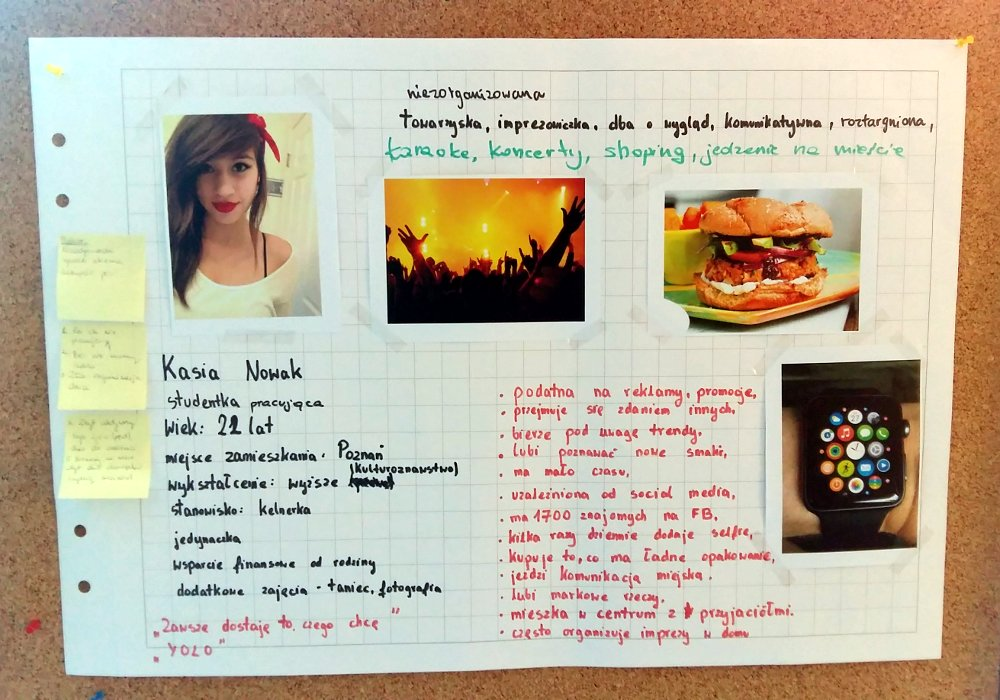

Projekt został wykonany w&nbsp;2017 r. w&nbsp;ramach programu „<a href="http://geocentrum.home.amu.edu.pl/">Geocentrum Doskonałości</a> -&nbsp;autorskiego programu dostosowywania studentów Wydziału Nauk Geograficznych i&nbsp;Geologicznych UAM do współczesnych wymagań rynku pracy” we współpracy z&nbsp;Kancelarią Urbanistyczną Filip Koczorowski.

Celem warsztatów był rozwój specjalistycznych kompetencji zawodowych oraz samoorganizacji w&nbsp;zakresie umiejętności planowania i&nbsp;twórczego rozwiązywania problemów poprzez wykonanie koncepcji zagospodarowania przestrzennego oraz miejscowego planu zagospodarowania przestrzennego wybranego obszaru zlokalizowanego w&nbsp;Żydowie. Cała praca została uprzedzona jednodniowym wyjazdem studialnym w&nbsp;teren, który był przedmiotem projektowania. Pozwoliło to na przeprowadzenie dokładnej inwentaryzacji, którą przedstawia jedna z&nbsp;plansz. Jako, że cały projekt został przeniesiony z&nbsp;kalki na komputer zajęcia pozwoliły również na podniesienie umiejętności wykorzystania specjalistycznych programów komputerowych.

	

<ul class="gallery">
	<li class="item" href="../assets/projects/geocentrum/5.jpg" style="background-image: url(../assets/projects/geocentrum/0.jpg);"></li>
	<li class="item" href="../assets/projects/geocentrum/1.jpg" style="background-image: url(../assets/projects/geocentrum/1.jpg);"></li>
	<li class="item" href="../assets/projects/geocentrum/2.jpg" style="background-image: url(../assets/projects/geocentrum/2.jpg);"></li>
	<li class="item" href="../assets/projects/geocentrum/3.jpg" style="background-image: url(../assets/projects/geocentrum/3.jpg);"></li>
	<li class="item" href="../assets/projects/geocentrum/4.jpg" style="background-image: url(../assets/projects/geocentrum/4.jpg);"></li>
	<li class="item" href="../assets/projects/geocentrum/7.jpg" style="background-image: url(../assets/projects/geocentrum/7.jpg);"></li>
	<li class="item" href="../assets/projects/geocentrum/5.jpg" style="background-image: url(../assets/projects/geocentrum/5.jpg);"></li>
</ul>
