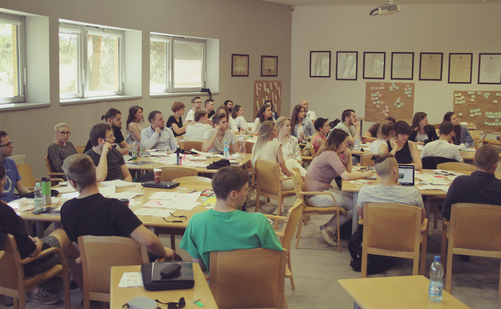

Wraz z&nbsp;grupą <a target="_blank" href="https://sealcode.org">Sealcode.org</a>, fundacją <a target="_blank" href="http://s2b.edu.pl/">Science2Business</a> oraz <a target="_blank" href="https://allegro.pl">Allegro</a> byłam inicjatorką pomysłu przeprowadzenia warsztatów User Experience dla studentów UAM, które odbyły 10 czerwca 2016r. na Wydziale Matematyki i&nbsp;Informatyki w&nbsp;Poznaniu.

Celem warsztatów było zaznajomienie studentów z&nbsp;tematyką User Experience poprzez poznanie pracy osób pracujących w&nbsp;firmie Allegro na stanowiskach badacz UX oraz projektant UX. Zajęcia składały się z&nbsp;dwóch części: teoretycznej oraz praktycznej. Podczas części teoretycznej studenci mieli okazję poznania podstawowych zagadnień tematyki User Experience niezbędnych w&nbsp;pracy zaproszonych prelegentów. W&nbsp;części praktycznej uczestnicy mieli okazje stworzyć swoje pierwsze makiety aplikacji mobilnej służącej uczestnikom festiwalu muzycznego.

	

<ul class="gallery">
	<li class="item" href="../assets/projects/sealcode/1.jpg" style="background-image: url(../assets/projects/sealcode/1.jpg);"></li>
	<li class="item" href="../assets/projects/sealcode/2.jpg" style="background-image: url(../assets/projects/sealcode/2.jpg);"></li>
	<li class="item" href="../assets/projects/sealcode/3.jpg" style="background-image: url(../assets/projects/sealcode/3.jpg);"></li>
	<li class="item" href="../assets/projects/sealcode/4.jpg" style="background-image: url(../assets/projects/sealcode/4.jpg);"></li>
	<li class="item" href="../assets/projects/sealcode/5.jpg" style="background-image: url(../assets/projects/sealcode/5.jpg);"></li>
</ul>
