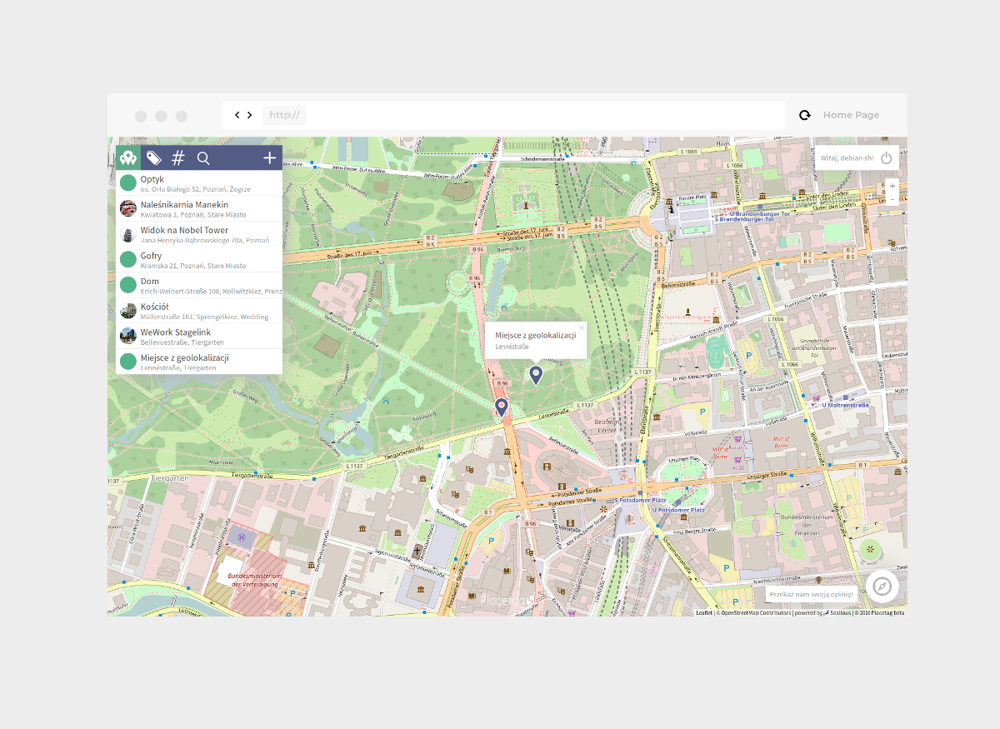
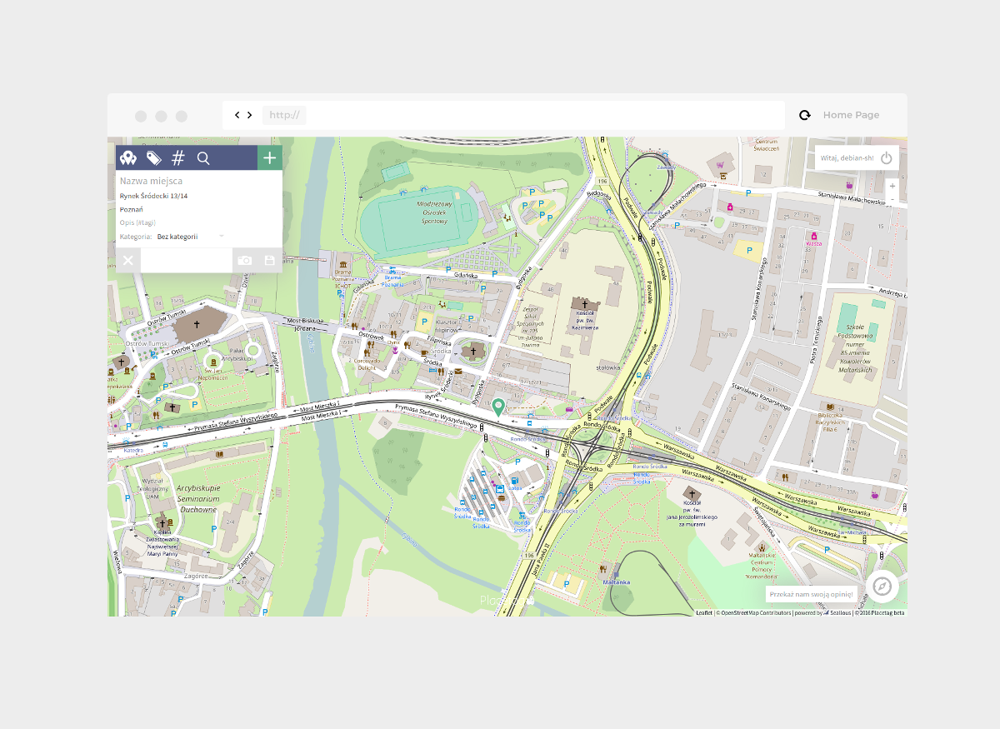
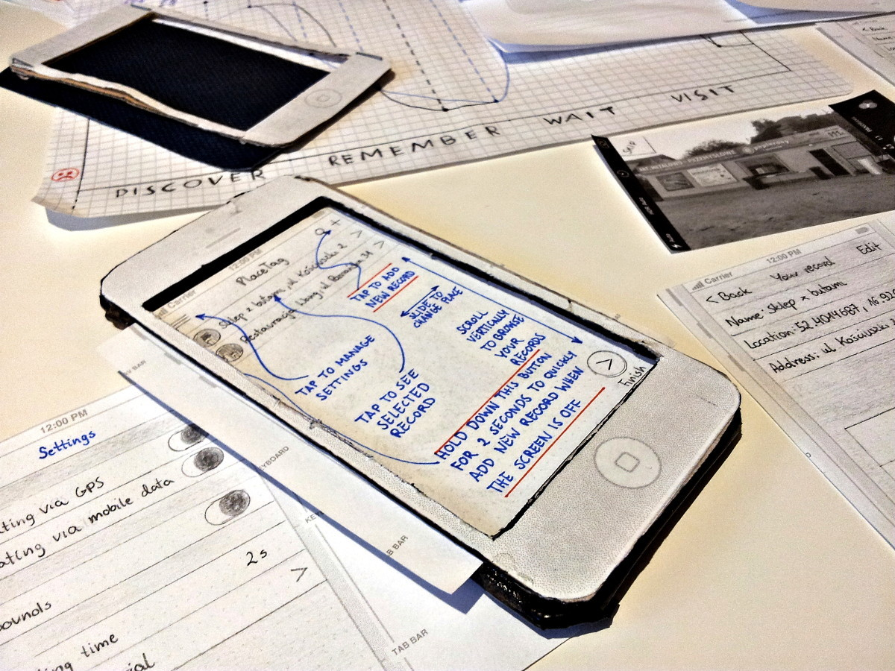
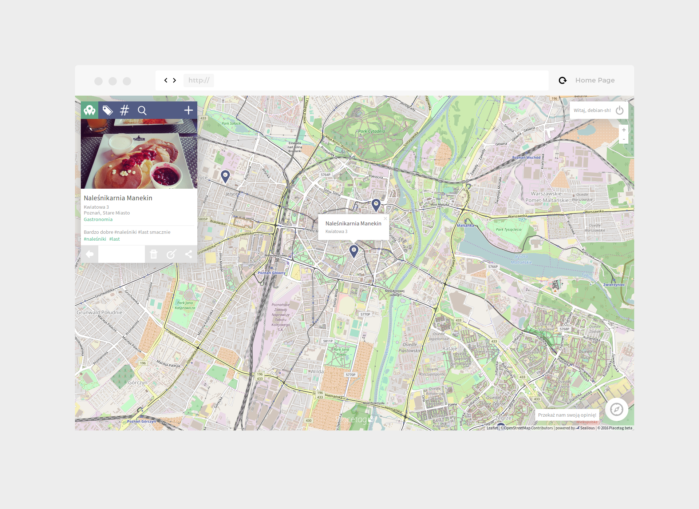
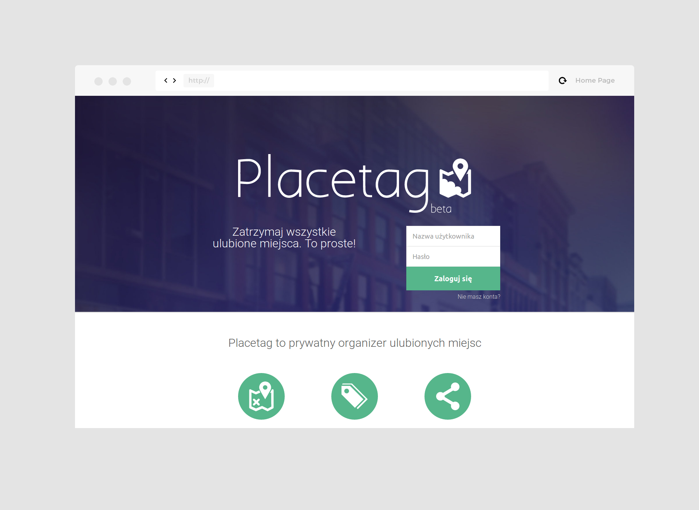

Last year I've prepared mockups and wireframes of web and mobile applications for Placetag.pl. I've conducted usability tests with paper prototypes for 7 users. I took also part in creating the final designs and the structure of web page.

About project: Placetag is the web and mobile application for saving places which you would like to visit at a later time. You can categorize saved places and share them places with your friends.

	

	

	

	

	

	

	

