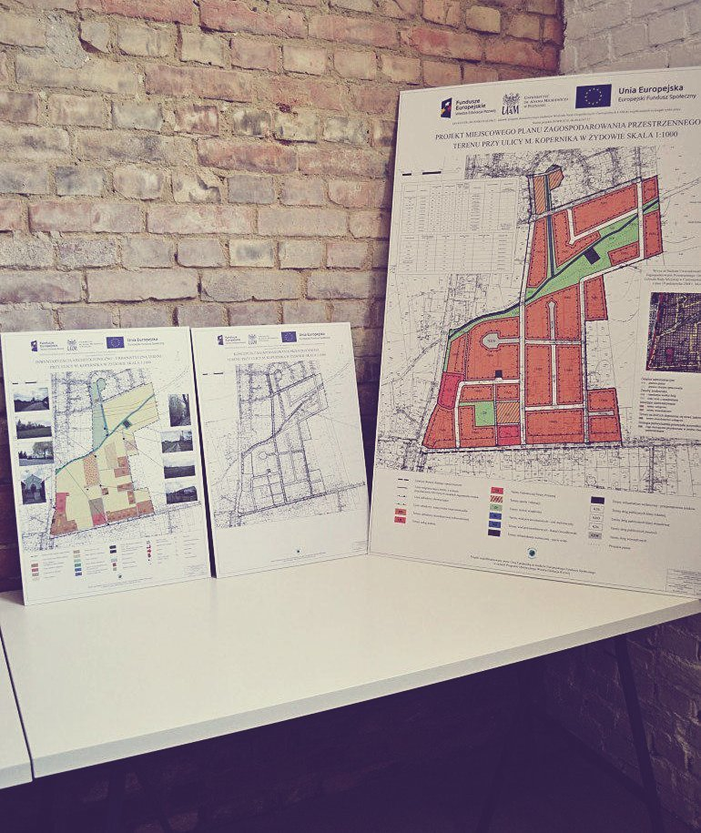
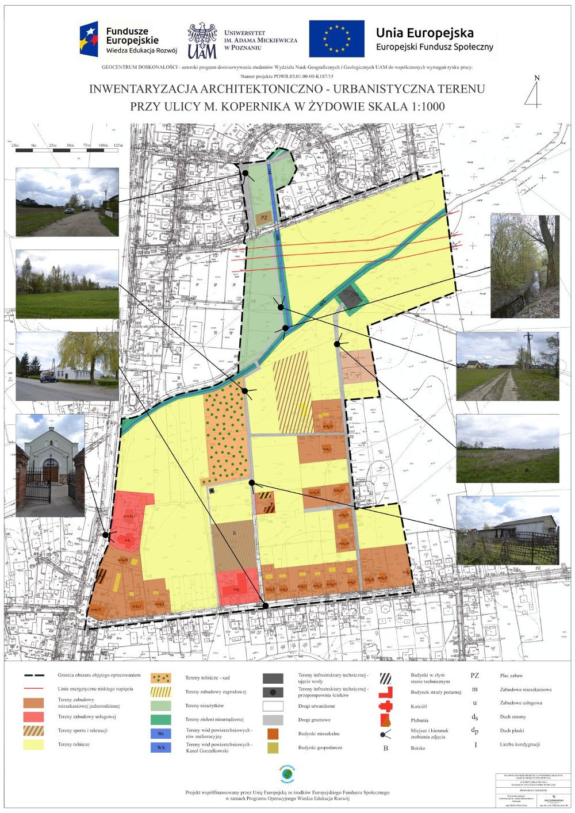
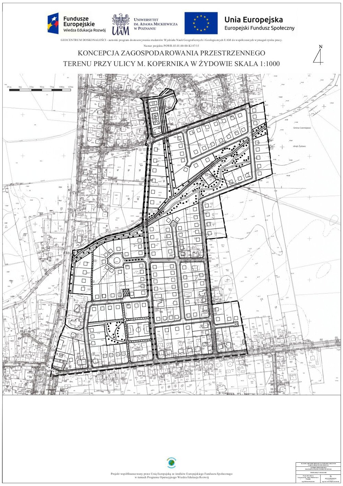

Projekt został wykonany w ramach programu „GEOCENTRUM DOSKONAŁOŚCI - autorski program dostosowywania studentów Wydziału Nauk Geograficznych i Geologicznych UAM do współczesnych wymagań rynku pracy” we współpracy z Kancelarią Urbanistyczną Filip Koczorowski. Celem warsztatów był rozwój specjalistycznych kompetencji zawodowych oraz samoorganizacji w zakresie umiejętności planowania i twórczego rozwiązywania problemów poprzez wykonanie koncepcji zagospodarowania przestrzennego oraz miejscowego planu zagospodarowania przestrzennego wybranego obszaru zlokalizowanego w Żydowie. Całą pracę należało uprzedzić jednodniowym wyjazdem studialnym w teren, który był przedmiotem projektowania. Pozwoliło to na przeprowadzenie dokładnej inwentaryzacji, którą przedstawia jedna z plansz. Jako, że cały projekt został przeniesiony z kalki na komputer zajęcia pozwoliły również na  podniesienie umiejętności wykorzystania specjalistycznych programów komputerowych.

	

